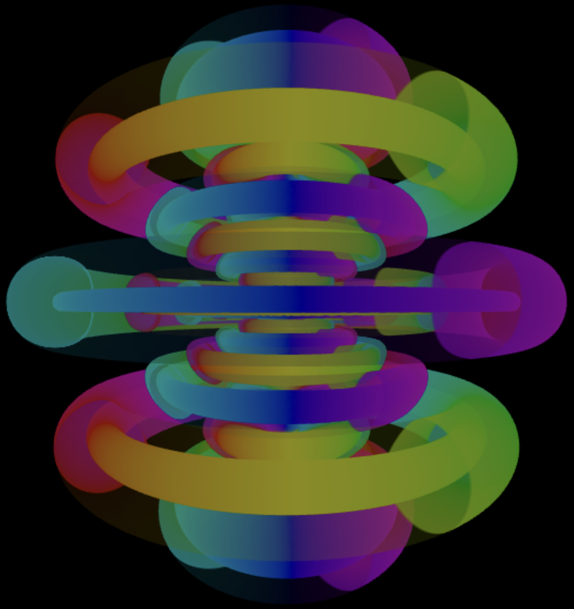

# Hydrogen Wave Function Visualisation Program

example : n:4, l:2, m:-1 && n:11 l:5 m:1 with added material:full iso value layer

> Credits : this visualization of hydrogen is largely inspired by [Dr. Bernd Thaller](https://vqm.uni-graz.at/pages/thaller.html)'s [*quantum graphics gallery*](https://vqm.uni-graz.at/pages/qm_gallery/index.html)

> Objective : partially reproducing Dr. Bernd Thaller's hydrogen visualization program for the web for easier access ( and for fun :) )

# User-side docs

### First Input (Quantum Parameters)

- 3 quantum numbers describe the electron state (omitting the spin):
	- N : main
	- L : orbital
	- M : magnetic
- You can either display the modulus of the wave function $|\Psi(r,\theta)|$ or its density of probability $r^2 \sin(\theta) |\Psi(r,\theta)|^2$
- The precision slider will change the density of sampled points in the subset of the 3d space.
- When ready, press **apply**. The values entered needs to be validated against a set of rules, if an error occur, it will be displayed on top.

### Input : Iso values

In this visualization, we first evaluate the wave function (modulus or density) in a subset of the 3D space, then we choose a value (*iso value*) that will be used to decide what positions to retain (where the function evaluates to that value). The surfaces are then generated out of those positions.

> the subset size of the 3d space is relative to the average radius : $\frac{3}{2Z}[n^2 - l(l+1)]$

On apply, a first iso value is inputted corresponding to the multiplication of the average of both the radial and the angular function.

To add new iso values:
1. Input a value not too far from the initial values (like 5x, 10x)
2. Then, choose the type of material (full, cut-see-through,...), wireframe is an option that shows the vertexes. 
3. When done, press **add**.

Once its added : 
- the visibility can be toggled on and off by the checkbox on the left side
- the iso surface can be removed with `x`

### Output : Gui Selection

You can either show: 
- the iso surfaces (3d visualization), (**default option**)
- the two functions (radial and angular) forming the hydrogen wave function : $\Psi = Y_l^m(\theta, \phi) R_{n_r,l} (r)$

### Output : Color Interpretation

The wave function is complex, a trick to represent both part in a real space is to assign the shape to its modulus (or to a density function), and then assign the remaining complex phase to colors (their hue).

The color is represented using HSL values (hue, saturation, luminosity)

- the saturation is always set to 1.0
- the luminosity follows the modulus. Higher iso values gets brighter colors.
- the hue represent the phase (which also include the sign of the wave function).
  - in case of a positive wave function, the phase is $m \phi$ : $e^{i m \phi}$
  - when negative : -1 = $e^{i\pi}$ would add $\pi$ to the phase : $e^{i (m \phi + \pi)}$

[link for more info (Dr. Bernd Thaller)](https://vqm.uni-graz.at/pages/colormap.html )

# Technical-side docs

### Technologies used :
- *Svelte* : front end framework
- *Rust -> Wasm* : data structures and methods defined in a better suited language for intensive calculation. The methods and object creation gets called in javascript, the calculation is made in the wasm program, then a pointer to the final data is sent to javascript for display on the web
- *Js libraries*
	- *Threejs* (to easily use webgl and display 3d shapes)
	- *Mathjax* (to display latex formulas)
	- *Plotly* (to plot functions)

> *Work In Progress...* for now its better to ask me directly for user-side issues or new functionality request (damian.hubert@ulb.be)